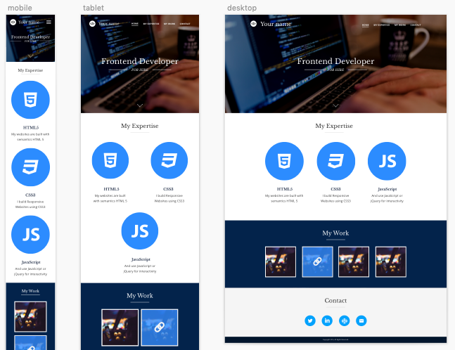
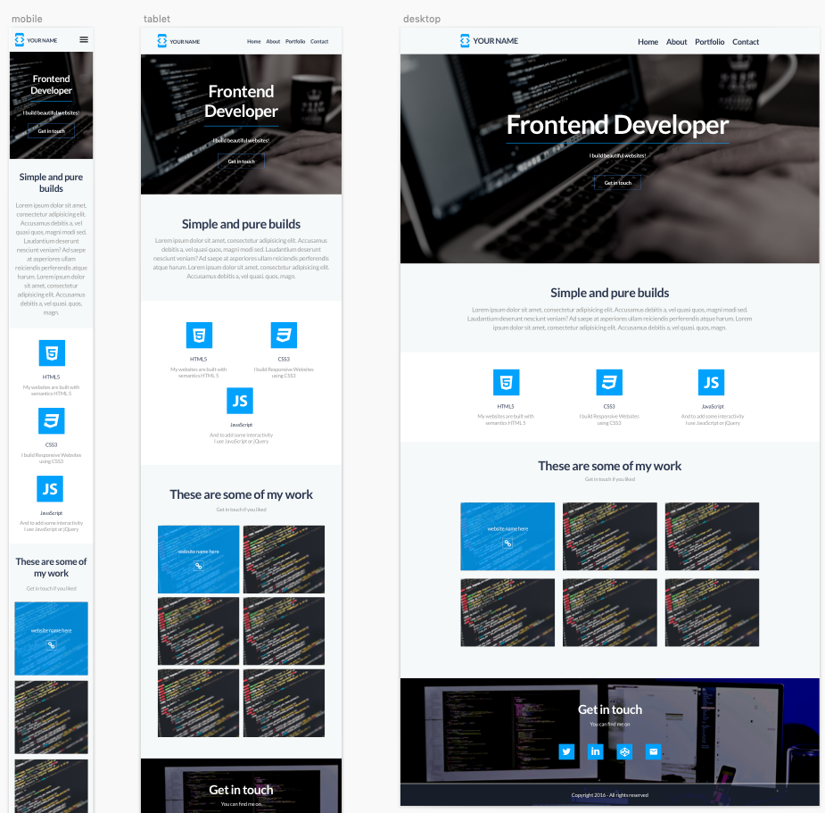

# Portfolio Challenge

This is a mock project, like the one I used to send to applicants at a company I used to work for. As the Frontend Lead Developer, one of my responsibilities was to judge Frontend and Fullstack Developers applying for open positions. After an initial phone screening and a face to face meeting I would send this challenge to try to get a feeling of the skills of each candidate.

## Goals

These are some goals I want to achieve with this project:

1. to show entry level **Frontend Developers** that – yes – there are still some companies and managers that do think it's enough to know HTML, CSS and some JavaScript for some positions.
2. to provide a real (or something as close to a real) project that an agency, for instance, would send to possible candidates. This should serve as a mock test, with real rules.
3. to allow peer feedback once a Pull Request (_PR_) is made. _OBS: I'll try my best to review each PR, at least for now._
4. to serve as a portfolio project. You invest time doing this challenge, you learn from it, you receive some feedback and you end up with another project on your portfolio 😉
5. giving back to the community! I've used several open source projects, I got help from several developers around the globe when I had issues. Now it's my turn to give something back in a more structured manner.

## Project Briefing

The client wants to redesign and rebuild his current portfolio website in a Responsive Web Design (RWD) manner. We have produced 2 designs and the client has approved both of them. You should pick one of the 2 designs and build it.

### Assets

There are 2 different designs for this project and you should pick only one of them. The designs are provided in _.sketch_ format as well as _JPG_. You don't need [Sketch](https://www.sketch.com/?utm_source=gledsleymuller-portfoliochallenge&utm_medium=github&utm_term=referral) to open the project, but you can use the trial version if you want. Alternatively, you to can use [Photopea](https://www.photopea.com/?utm_source=gledsleymuller-portfoliochallenge&utm_medium=github&utm_term=referral) as it's a free web app and it opens _.sketch_ files, usually without any issues.

Both designs can be found on the `designs/` directory.

### Portfolio Type 1

### Portfolio Type 2

_OBS: you should read the [rules](#rules) for this challenge._

### Mobile Menu

The mobile menu designs are missing. That means you will have to come up with a solution for the menu. Use your best judgment and make the client happy with your solution 😉.

### Fonts

The fonts used on both designs can be found on [Google Fonts](https://fonts.google.com/).

### Breakpoints

The website is expected to look as close to the original designs as possible in all screen sizes. Having said that, there are at least 4 breakpoints that should be taken into consideration:

1. 320px (width)
2. 768px (width)
3. 1024px (width)
4. 1440px (width)

_OBS: The designs only provide 3 of these 4 breakpoints. Use the Desktop designs (1440px wide) as a reference to breakpoint 1024px._

### Dynamic functionality

The client would like to have her repos pulled from github and displayed on the `Work` section. For that, you will have to use [github REST API v3](https://developer.github.com/v3/).

_OBS: Make sure that the maximum number of repositories displayed on this section is 12._

### Browser support

Based on the current website visitors, the client says she wants the new website to be compatible with the following browsers:

- Internet Explorer 11
- Edge 18 and up
- Chrome (2 latest versions)
- Safari (2 latest versions)

## Rules for this challenge

- **NO FRAMEWORKS ALLOWED!** So, forget about Bootstrap, Foundation, Bulma, React, Vue, Angular or whatever framework you are used to use for your projects. I want to see handcrafted HTML, CSS and JavaScript.
- Clone this repository (_repo_), make a minor amend on any file, commit and make a PR stating CLEARLY which [challenge type](#challenge-types) you want to be part of.
- Once your project is built, push the amends to your clone/branch and leave a comment on the same PR with a link to where you deployed the website.

Feel free to add some niceties you believe would be good for UX.

## Challenge types

For real, I would expect a Junior Frontend Developer to build this page in about 5 days (around 40h) of work, if it were a full time job. But I understand some of you will have other day jobs, school, uni, kids, a life to deal with. And thinking of that, I created these 3 types of challenge for you to pick:

### 5 days

You've got 5 days to build this. So, let's say you've got this on Monday morning, I expect the PR and a link to the website on Friday, 5:30pm. You can start any day of the week, at any time. Just [track your time](#track-your-time) and export the timesheets to a pdf and put it on the repository (inside `place-your-timesheets-here/` directory).

This challenge type is advised to those who don't have a full time job and are dedicating this time of their lives to learn how to code and preparing for job interviews. This is the closest to a real case scenario at an agency so choose this one if you really want the 'real' experience. You shouldn't work more than 7,5h a day on this challenge type.

### 40 hours

You want to do the challenge but you can't be sure you can get it done in 5 days or less. Just [track your time](#track-your-time) and export the timesheets to a pdf and put it on the repository (inside `place-your-timesheets-here/` directory). It should show up to 40h working on the project.

This challenge type is advised to those with a busy life (another full time job, studies, kids etc.). Try to get at least 3h a day on this challenge otherwise you'll lose interest and not finish the job.

### No time limit

You are just starting and you think you can't do it in 5 days or 40h. Or you started the challenge in one of the other types but something came up (life is hard, trust me, I get it) and you exploded the deadline. Fair enough, the important thing is to finish the job (the challenge, in this case), no matter what. Just [track your time](#track-your-time) and export the timesheets to a pdf and put it on the repository (inside `place-your-timesheets-here/` directory). Although there's no time limit for this challenge type, it will be good for you to know how long it took you to build the project.

## Track your time

No matter what [challenge type](#challenge-types) you choose, you should track your time. This is the only way to see how long it takes you to build this project and will give you an idea if it's taking you too long to get it done. It will also help you estimate other future projects.

Just track your time using a tool like [Toggl](https://www.toggl.com/https://www.toggl.com/?utm_source=gledsleymuller-portfoliochallenge&utm_medium=github&utm_term=referral) and export the timesheets to a pdf and put it on the repository.

_TIP: try to break down the timesheets on different sections/functionalities you build. This way, you'll be able to see where you spent more time during the build._

## What I will check

The main points I usually check on a project like this are:

- Semantics HTML
- CSS
- JavaScript
- git
- Attention to detail (because people love to write this on their CVS, but not many really have this skill)
- Reading and interpretation skills
- Browser testing
- Capability of taking decisions independently
- Eye for design (UX/UI)

These points tell me a lot about a developer's skills set.

## Problems or doubts

Do you have a questions about the challenge? Do you have issues with the sketch files? [Create an issue](https://github.com/gepetobio/portfolio-challenge/issues) and I'll address your needs accordingly.

## Help me out

Give this repo a star, create issues with ideas, fix typos, tweet about this challenge. Just don't think twice before [getting in contact with me](https://twitter.com/gepetobio), ok?
